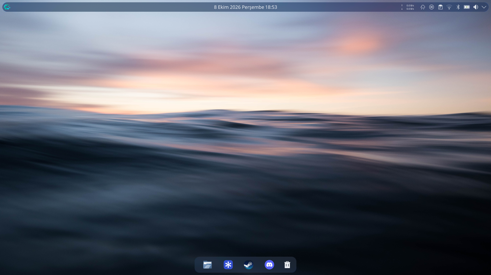

# TNFX-Plasma

A clean, portable KDE Plasma 6 appearance configuration (dotfiles) repository.

## Preview



## Features

- **Look-and-Feel**: Utterly-Nord
- **Plasma Style**: blackglass (desktop theme)
- **Color Scheme**: Derived from Utterly-Nord
- **Icon Theme**: Breeze Dark
- **Cursor Theme**: Breeze Cursor
- **Window Decoration**: Aurorae (with custom settings)
- **Application Style**: Breeze
- **GTK Theme**: Breeze (matched via GTK settings)
- **Font Configuration**: System defaults (Noto Sans, etc.)
- **Plasma Panel**: Configured panel layout with widgets
- **Desktop Widgets**: Folder view with wallpaper settings
- **KWin Effects**: Blur, translucency, wobbly windows enabled
- **Compositing**: VSYNC disabled, OpenGL 3.1
- **Tiling Windows**: Example tiling configurations (customizable)
- **System Tray**: Icons and visibility settings
- **Wallpaper Configuration**: Placeholder for personal wallpapers

## Themes Used

The configuration references the following third-party themes. Please install them before applying this configuration:

- **Look-and-Feel Package**: [`Utterly-Nord`](https://store.kde.org/p/1266491/)  
  Install via KDE System Settings → Look and Feel → Get New Look-and-Feel or via package manager.
- **Plasma Style (Desktop Theme)**: [`blackglass`](https://store.kde.org/p/1313929/) (or any preferred)
- **Icon Theme**: `Breeze Dark` (usually part of `breeze-icons` package)
- **Cursor Theme**: `Breeze Cursor` (default)

> **Note**: The repository does **not** include the actual theme assets due to redistribution restrictions. Install the themes using the links above or your distribution's package manager.

## Wallpaper

Place your preferred wallpaper images in:
```
$HOME/.local/share/wallpapers/
```
The configuration is set to use a wallpaper named `Aritim-Dark-Wallpaper-1920x1080.jpg` as an example. Replace it with your own or adjust the slideshow paths in `plasma-org.kde.plasma.desktop-appletsrc`.

## Requirements

- KDE Plasma 6 (tested on 6.1+)
- Qt 6
- KDE Frameworks 6
- Optional: `breeze-icons` for icon theme
- Optional: `Aurorae` engine for window decoration (built-in)

## Installation

### Automatic Installation

```bash
git clone https://github.com/yourusername/TNFX-Plasma.git
cd TNFX-Plasma
./install.sh
```

The script will:
1. Verify KDE Plasma 6 is available.
2. Backup your existing configuration to `~/.config-TNFX-Plasma-backup-<timestamp>/`.
3. Copy the configuration files to `~/.config/`.
4. Replace path placeholders with your actual `$HOME`.
5. Provide post-installation instructions.

> **Important**: After installation, log out and log back in, or run `plasmashell --replace` to apply changes.

### Manual Installation

1. Clone or copy this repository to your machine.
2. Backup your current KDE config (optional but recommended):
   ```bash
   cp -r ~/.config ~/.config.backup
   ```
3. Copy the contents of the `config/` directory to `~/.config/`:
   ```bash
   cp -r config/* ~/.config/
   ```
   (Ensure you merge directories like `gtk-3.0/` and `gtk-4.0/` correctly.)
4. Replace all occurrences of `/home/<username>` in `~/.config/plasmarc` and `~/.config/plasma-org.kde.plasma.desktop-appletsrc` with your actual `$HOME` path (e.g., `/home/youruser`).
5. Install the required themes (see "Themes Used" above).
6. Add your wallpapers to `$HOME/.local/share/wallpapers/`.
7. Restart Plasma:
   - Log out and log back in, **or**
   - Run `plasmashell --replace` (press `Alt+F2`, type the command, and enter).

## Backup and Restore

The `install.sh` script automatically creates a backup of your existing configuration in:
```
~/.config-TNFX-Plasma-backup-<timestamp>/
```

To restore manually:
1. Close all Plasma sessions.
2. Copy the backup directory contents back to `~/.config/`:
   ```bash
   cp -r ~/.config-TNFX-Plasma-backup-<timestamp>/* ~/.config/
   ```
3. Restart Plasma.

## Uninstallation

To revert to your previous configuration:
1. If you have a backup from the installer, restore it as described above.
2. Otherwise, manually revert any changed configuration files or reconfigure via System Settings.

## Customization

After installing, you can further tweak the appearance via:
- System Settings → Appearance
- System Settings → Workspace → Window Management
- Right-click on the panel → Edit Panel
- Right-click on desktop → Configure Desktop

## Notes

- This repository focuses **only** on visual appearance and desktop layout. It does not include:
  - Application-specific configurations (e.g., Dolphin, Konsole, Kate)
  - Network settings
  - Hardware configurations
  - Personal data (passwords, keys, etc.)
- The configuration is designed to be portable across different machines running KDE Plasma 6.
- Some settings (like monitor configurations, color profiles, and tiling rules) may require manual adjustment after installation.
- The script does not use `sudo` and performs no system-wide changes.

## License

This configuration is provided as-is under the MIT License. Feel free to adapt and share.

---

**TNFX-Plasma** – Make your KDE Plasma desktop uniquely yours.
